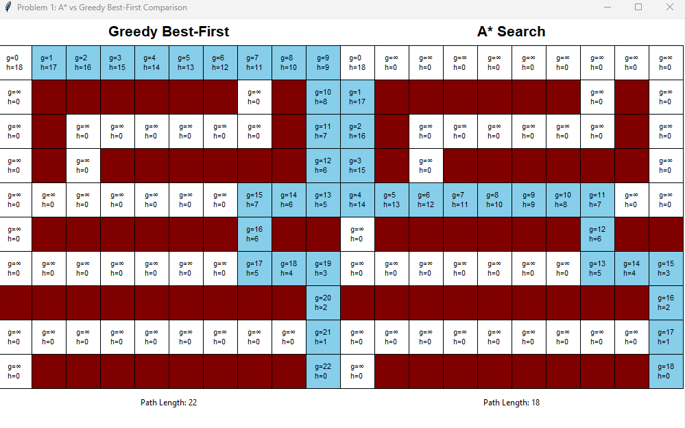
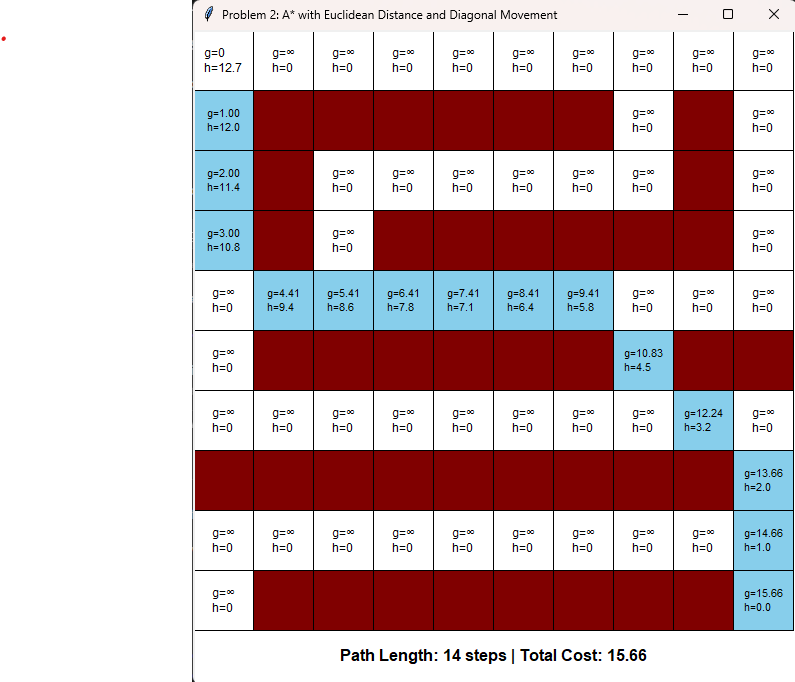
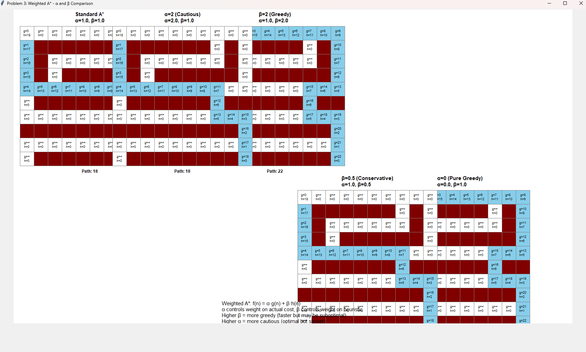

# Assignment 3 - A* Algorithm Variants
## Technical Report

**Author:** Kenny A
**Course:** CSC 362 - Artificial Intelligence
**Semester:** Fall 2025
**Date:** October 21, 2025

---

## Problem 1: A* vs Greedy Best-First Search

this problem compares two pathfinding algorithms side by side on the same maze configuration to show how their different evaluation functions affect the paths they find. A* uses f(n) = g(n) + h(n) which considers both the actual cost from start to current node and the estimated cost to the goal, while greedy best first search only uses f(n) = h(n) which just looks at how close it thinks it is to the goal. both algorithms use manhattan distance as their heuristic since we're doing 4 directional movement on a grid. the implementation displays both searches simultaneously on a shared canvas so you can visually compare how A* finds the optimal path while greedy might take a suboptimal route by being too aggressive about moving toward the goal.

**key differences:**
- A* guarantees optimal path by balancing actual cost and heuristic
- greedy is faster but can produce longer paths
- greedy explores fewer nodes since it's more aggressive
- both use same maze and manhattan distance heuristic

**code snippet showing main difference:**
```python
if self.algorithm == "greedy":
    self.cells[new_pos[0]][new_pos[1]].f = self.cells[new_pos[0]][new_pos[1]].h  # greedy: f(n) = h(n)
else:
    self.cells[new_pos[0]][new_pos[1]].f = new_g + self.cells[new_pos[0]][new_pos[1]].h  # A*: f(n) = g(n) + h(n)
```

**results:**



- greedy path length: 22
- A* path length: 18
- difference: 4

the comparison shows that A* is better when you need guaranteed optimal paths (like gps navigation) while greedy is good for real-time systems where speed matters more than perfect solutions (like video game AI).

---

## Problem 2: A* with Euclidean Distance and Diagonal Movement

this problem extends A* to allow 8-directional movement including diagonals (NE, NW, SE, SW) and uses euclidean distance as the heuristic instead of manhattan distance. diagonal moves cost √2 (approximately 1.414) while cardinal moves (N, S, E, W) cost 1 to properly reflect the geometric distance. the euclidean heuristic is calculated as √((x₁-x₂)² + (y₁-y₂)²) which gives the straight-line distance between two points. moves are randomized each time to add variation but this doesn't affect optimality since A* still finds an optimal path. this approach is more realistic for scenarios where agents can move in any direction like robots or characters in games.

**key features:**
- 8 directions of movement with proper cost weighting
- euclidean distance heuristic for diagonal scenarios
- random move ordering as required by assignment
- maintains A* optimality with admissible heuristic

**code snippet showing diagonal movement:**
```python
moves = [
    (0, 1, 1), (0, -1, 1), (1, 0, 1), (-1, 0, 1),         # cardinal: cost 1
    (-1, 1, math.sqrt(2)), (-1, -1, math.sqrt(2)),        # diagonal: cost √2
    (1, 1, math.sqrt(2)), (1, -1, math.sqrt(2))
]
random.shuffle(moves)  # randomize order
```

**results:**



- path length (steps): 14
- total path cost: 15.66
- diagonal moves used: 3

diagonal movement produces shorter geometric paths compared to strict 4-directional movement and looks more natural. the √2 cost ensures diagonals aren't unfairly cheap while euclidean distance provides better heuristic guidance for this movement model.

---

## Problem 3: eeighted A* with α and β parameters

this problem explores weighted A* which modifies the standard evaluation function to f(n) = α·g(n) + β·h(n) where α controls the weight on actual path cost and β controls the weight on the heuristic estimate. by adjusting these parameters you can tune the algorithms behavior from very cautious (high α) to very greedy (high β). tested five different configurations simultaneously: standard A* (α=1, β=1), greedy bias (α=1, β=2), pure greedy (α=0, β=1), cautious (α=2, β=1), and conservative (α=1, β=0.5). the β parameter essentially acts as a "greediness knob" where higher values make the search faster but potentially suboptimal while lower values ensure better solution quality at the cost of more computation.

**tested configurations:**
- standard A* (α=1.0, β=1.0) - balanced traditional A*
- greedy bias (α=1.0, β=2.0) - emphasizes getting closer to goal
- pure greedy (α=0.0, β=1.0) - only considers heuristic
- cautious (α=2.0, β=1.0) - heavily weighs actual cost
- conservative (α=1.0, β=0.5) - less influenced by heuristic

**code snippet showing weighted evaluation:**
```python
# weighted A*: f(n) = α·g(n) + β·h(n)
self.cells[new_pos[0]][new_pos[1]].f = (
    self.alpha * new_g +
    self.beta * self.cells[new_pos[0]][new_pos[1]].h
)
```

**results:**




**findings:**
- β > 1 makes algorithm more greedy (faster but potentially suboptimal)
- β < 1 makes algorithm more conservative (thorough but slower)
- β = 0 gives dijkstra's algorithm (no heuristic)
- α = 0 gives pure greedy best-first (no cost consideration)
- higher β trades optimality for speed

weighted A* is useful in real time systems where you can adjust the weights based on how much time you have - you can use high β when you need quick approximate solutions and low β when you need guaranteed optimal paths.

---

## conclusion

the three problems showed different aspects of A* search and its variants. problem 1 demonstrated that A* guarantees optimal paths by considering both actual cost and heuristic while greedy best-first is faster but may be suboptimal. problem 2 showed that diagonal movement with euclidean distance produces more realistic and efficient paths when properly weighted. problem 3 revealed that weighted A* with α and β parameters provides a tunable spectrum from greedy to cautious behavior, letting you balance speed versus optimality based on your application needs. overall, the choice of algorithm depends on whether you prioritize solution quality (use A*), speed (use greedy or weighted A* with high β), or need something in between (tune the weights).

---

## References

1. Introduction to A* (Amit's A* Pages):
   http://theory.stanford.edu/~amitp/GameProgramming/AStarComparison.html

2. Heuristics for Grid-Based Pathfinding (Amit's A* Pages):
   http://theory.stanford.edu/~amitp/GameProgramming/Heuristics.html

3. Variants of A* (Amit's A* Pages):
   https://theory.stanford.edu/~amitp/GameProgramming/Variations.html

---

## Running the Programs

**problem 1:**
```bash
cd "C:..\AI HW\Assignment 3"
python Problem1solution.py
```
- displays two mazes side-by-side (greedy left, A* right)
- screenshot: capture both mazes with paths and path lengths

**problem 2:**
```bash
python Problem2solution.py
```
- displays single maze with diagonal movement
- screenshot: capture maze showing diagonal path and statistics

**problem 3:**
```bash
python Problem3solution.py
```
- displays five maze configurations with different α and β values
- screenshot: capture all five mazes (may need to maximize window)

---

